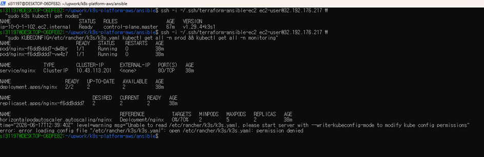
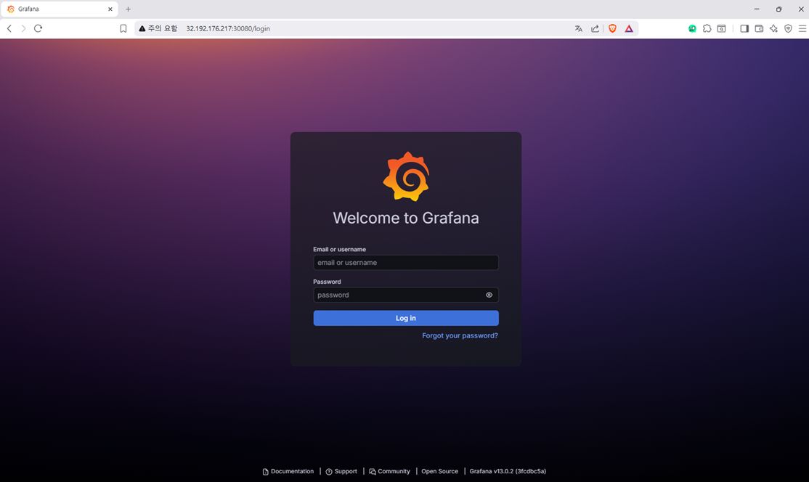
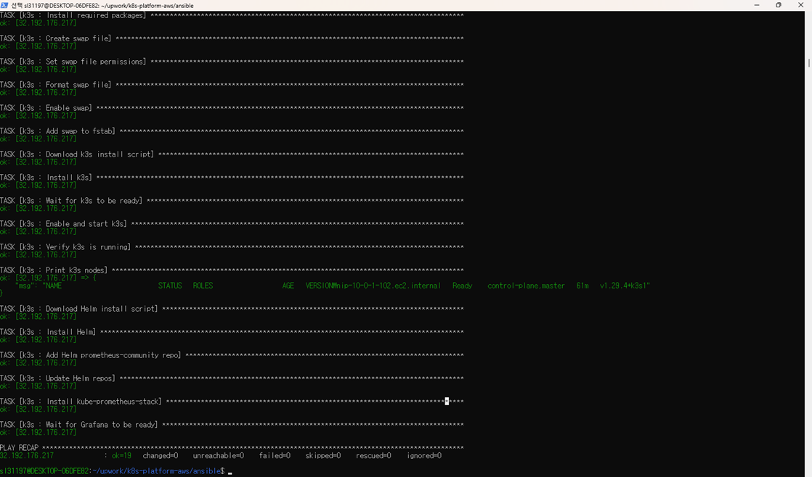

# Production Kubernetes Platform on AWS

[](https://github.com/wndudkr2024/k8s-platform-aws/actions/workflows/ci.yml)

Production-style Kubernetes platform on AWS using Terraform, Ansible, k3s, Helm, and Prometheus/Grafana monitoring.

---

## What This Does

1. **Terraform** provisions a complete AWS network and compute layer
2. **Ansible** installs k3s, Helm, and deploys the monitoring stack automatically
3. **Kubernetes manifests** deploy applications with namespace isolation, HPA, and Ingress
4. **Prometheus + Grafana** provide real-time cluster monitoring

---

## Architecture

Terraform

↓

AWS VPC (10.0.0.0/16)

├── Public Subnet

├── Internet Gateway

├── Route Table

├── Security Group (SSH, HTTP, HTTPS, 6443, 30080, 30090)

└── EC2 t3.small (Amazon Linux 2023, 20GB gp3)

↓

Ansible

├── Swap memory (2GB)

├── k3s installation

├── Helm installation

└── kube-prometheus-stack (Prometheus + Grafana)

↓

Kubernetes

├── Namespace: dev / prod

├── Deployment (nginx, 2 replicas)

├── Service (ClusterIP)

├── Ingress (Nginx Ingress Controller)

└── HorizontalPodAutoscaler (2-5 replicas, 70% CPU)

↓

Monitoring

├── Prometheus (NodePort :30090)

└── Grafana (NodePort :30080)

---

## Stack

| Tool | Version |
|---|---|
| Terraform | >= 1.5.0 |
| AWS Provider | ~> 6.0 |
| k3s | v1.29.4+k3s1 |
| Helm | v3.x |
| kube-prometheus-stack | latest |
| Amazon Linux | 2023 |

---

## Infrastructure (Terraform)

| Resource | Details |
|---|---|
| VPC | 10.0.0.0/16, DNS enabled |
| Public Subnet | 10.0.1.0/24 |
| Internet Gateway | Attached to VPC |
| Route Table | 0.0.0.0/0 via IGW |
| Security Group | SSH, HTTP, HTTPS, K8s API, Grafana, Prometheus |
| EC2 | t3.small, Amazon Linux 2023, 20GB gp3 |

---

## Kubernetes Resources

| Resource | Namespace | Details |
|---|---|---|
| Deployment | prod | nginx 1.25-alpine, 2 replicas |
| Service | prod | ClusterIP :80 |
| Ingress | prod | Nginx Ingress Controller |
| HPA | prod | 2-5 replicas, 70% CPU threshold |
| Namespace | dev/prod | Environment isolation |

---

## Monitoring

| Tool | Access | Default Credentials |
|---|---|---|
| Grafana | http://\<EC2_IP\>:30080 | admin / (see secret) |
| Prometheus | http://\<EC2_IP\>:30090 | - |

Get Grafana password:
```bash
kubectl get secret --namespace monitoring monitoring-grafana \
  -o jsonpath='{.data.admin-password}' | base64 -d
```

---

## Usage

### 1. Provision Infrastructure

```bash
cd terraform/
terraform init
terraform apply
```

### 2. Configure Inventory

```ini
[k3s]
<EC2_PUBLIC_IP>

[k3s:vars]
ansible_user=ec2-user
ansible_ssh_private_key_file=~/.ssh/your-key
ansible_ssh_common_args='-o StrictHostKeyChecking=no'
```

### 3. Run Ansible

```bash
cd ansible/
ansible-playbook -i inventory.ini site.yml
```

### 4. Apply Kubernetes Manifests

```bash
kubectl apply -f k8s/namespaces/
kubectl apply -f k8s/deployments/
kubectl apply -f k8s/services/
kubectl apply -f k8s/ingress/
kubectl apply -f k8s/hpa/
```

### 5. Destroy Infrastructure

```bash
cd terraform/
terraform destroy
```

---

## Code Quality

```bash
yamllint ansible/ k8s/
ansible-lint ansible/site.yml
terraform fmt -check
terraform validate
```

---

## Screenshots

### Kubernetes Nodes and Resources



### Grafana Dashboard



### Idempotent Ansible Execution (changed=0)



---

## Design Principles

- **Fully automated** — one Ansible run installs k3s, Helm, and monitoring stack
- **Idempotent** — safe to run multiple times
- **Production-style** — namespace isolation, resource limits, HPA, monitoring
- **IaC** — 100% infrastructure and configuration as code

---

## Disclaimer

This project demonstrates production patterns used in enterprise environments.
